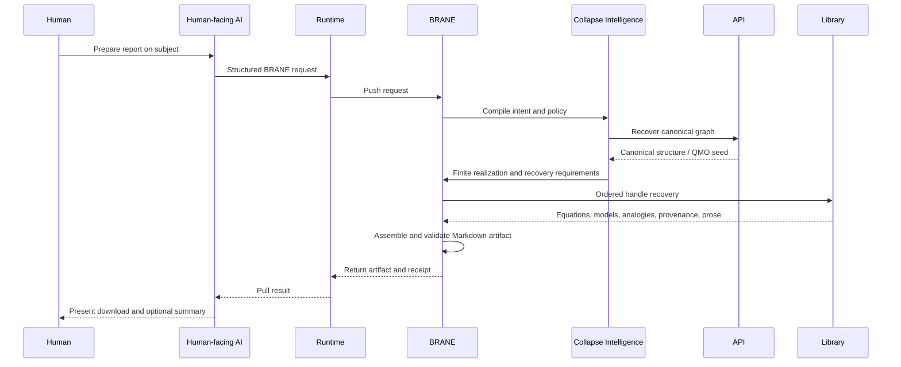

# Sequence Diagram

```mermaid
sequenceDiagram
    participant H as Human
    participant C as Human-facing AI
    participant R as Runtime
    participant B as BRANE
    participant I as Collapse Intelligence
    participant A as API
    participant L as Library

    H->>C: Prepare report on subject
    C->>R: Structured BRANE request
    R->>B: Push request
    B->>I: Compile intent and policy
    I->>A: Recover canonical graph
    A-->>I: Canonical structure / QMO seed
    I->>B: Finite realization and recovery requirements
    B->>L: Ordered handle recovery
    L-->>B: Equations, models, analogies, provenance, prose
    B->>B: Assemble and validate Markdown artifact
    B-->>R: Return artifact and receipt
    R-->>C: Pull result
    C-->>H: Present download and optional summary
```
